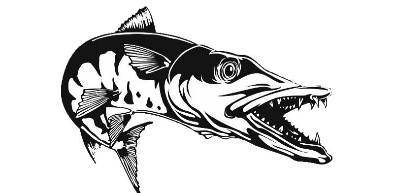
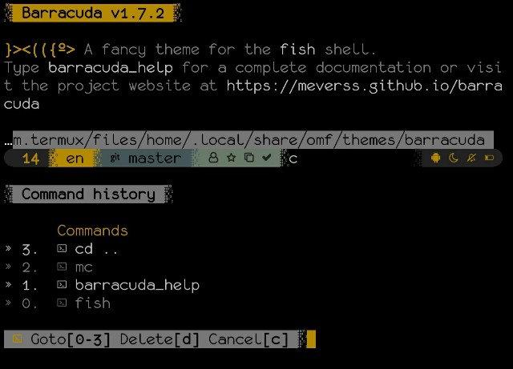

## Description:

Barracuda theme makes fish shell even more powerful and user-friendly.

It's equipped with a set of useful functions and key bindings to speed up your workflow.

Also, the use of `Powerline Symbols` makes the visual experience smooth and fancy.

This theme is a fork of [oh-my-fish/theme-budspencer](https://github.com/oh-my-fish/theme-budspencer), which means it keeps most of it's awesome features.

